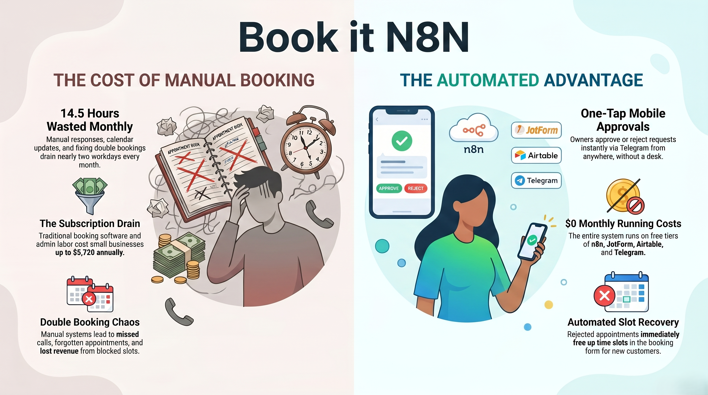
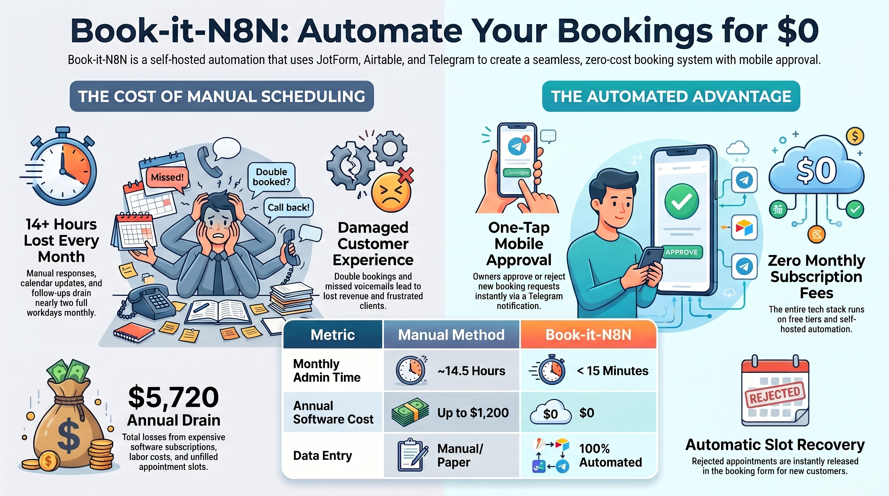
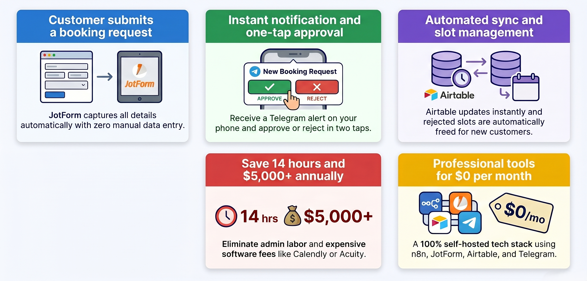

## Book-it-N8N

### *Zero subscriptions. Zero phone tag. Zero double bookings.*
---

## 🧩 Built With
 

&nbsp;

&nbsp;

&nbsp;

## 🎬 Demo Video

👆 *Click the button above to watch the full demo — see the complete appointment booking flow from JotForm submission to Telegram approval in action.*
---

## 🗺️ High-Level

---

## 💡 What Problem Does This Solve?

Most small businesses today still manage appointments through:

- 📞 Phone calls that go to voicemail
- 💬 Instagram or WhatsApp DMs
- 📝 Paper calendars on the wall
- 🗂️ Basic spreadsheets updated manually

This leads to **double bookings**, **missed calls**, **forgotten appointments**, and hours of wasted admin time every week — costing the business real money and damaging the customer experience.

**This n8n workflow replaces all of that with a fully automated, mobile-first system that costs nothing to run.**

---

## ✅ Use Cases — Who Is This For?

| Business Type | Problem Solved |
|---|---|
| 💇 Hair Salons & Barbershops | No more DM chaos for bookings |
| 🦷 Dental & Medical Clinics | Replace expensive scheduling add-ons |  
| 🏠 Handymen & Contractors | Qualify and confirm jobs before showing up |
| 💅 Nail Salons & Spas | Free up front desk during peak hours |
| 🧘 Personal Trainers | Manage 1-on-1 session requests professionally |
| 🍽️ Private Chefs & Caterers | Handle event inquiries without phone calls |
| 🚗 Auto Detailers | Stop losing jobs to missed voicemails |
| 📸 Photographers | Accept session requests 24/7 automatically |

---

## 🔥 Challenges This Workflow Solves

### Before This Workflow

| Challenge | Impact |
|---|---|
| Owner manually responds to every inquiry | 10–20 min per booking |
| No visibility into who booked what slot | Double bookings happen weekly |
| Customer follows up repeatedly waiting for confirmation | Poor customer experience |
| Rejected appointments keep the slot blocked | Lost revenue from unfilled slots |
| Expensive booking software required | $20–$100/month ongoing cost |
| Owner must be at a desk to manage bookings | No flexibility or mobility |
| No record of who approved or rejected what | Zero accountability or audit trail |

### After This Workflow

| Solution | Result |
|---|---|
| JotForm captures all customer details automatically | Zero manual data entry |
| Airtable stores every submission with status tracking | Full audit trail with timestamps |
| Telegram sends instant approval request to owner's phone | Owner responds in 2 taps from anywhere |
| One-time approval lock prevents duplicate status changes | No accidental overwrites |
| Rejected slots are automatically freed in JotForm | Next customer can book immediately |
| Response date and time logged automatically in Airtable | Full accountability on every decision |
| Entire system runs 24/7 on self-hosted n8n | No human intervention needed after setup |

---

## ⏱️ Time & Money Saved

### Time Saved Per Month

| Task | Old Way | With This Workflow | Saved |
|---|---|---|---|
| Responding to booking inquiries | 15 min × 30 = **7.5 hrs** | 0 min | **7.5 hrs** |
| Updating calendar or spreadsheet | 5 min × 30 = **2.5 hrs** | 0 min | **2.5 hrs** |
| Following up with customers | 10 min × 15 = **2.5 hrs** | 0 min | **2.5 hrs** |
| Fixing double bookings | 30 min × 4 = **2 hrs** | 0 min | **2 hrs** |
| **Total** | **~14.5 hrs/month** | **< 15 min/month** | **~14 hrs saved** |

### Money Saved Per Year

| Item | Annual Cost Eliminated |
|---|---|
| Booking software (Calendly / Acuity / etc.) | $240 – $1,200/year |
| Admin labor at $15/hr × 14 hrs/month | $2,520/year |
| Lost revenue from blocked rejected slots | $500 – $2,000+/year |
| **Total annual savings** | **$3,260 – $5,720+/year** |

> A small business handling just 30 appointments per month can save $3,000–$5,000+ per year with this free, self-hosted workflow.

---

## ⚙️ Key Features

- **One-tap approval** — owner approves or rejects from Telegram on their phone.
- **Duplicate prevention** — once a status is set, it cannot be changed again.
- **Automatic slot release** — rejected appointments immediately free the time slot in JotForm.
- **Full audit trail** — every submission tracked in Airtable with response timestamps.
- **No monthly fees** — 100% self-hosted on n8n
- **Mobile-first** — entire owner experience happens inside Telegram

---
## Workflow Impact

---

**Built for small businesses that deserve big-business tools.**

*Stop losing customers to missed calls. Start your automation today.*

